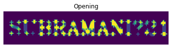

# Opening-and-Closing

## Aim
To implement Opening and Closing using Python and OpenCV.

## Software Required
1. Anaconda - Python 3.7
2. OpenCV
## Algorithm:
### Step1:
Import the necessary packages cv2, numpy and matplotlib.

### Step2:
Create the text using the built in function cv2.putText()

### Step3:
Create the structuring element.

### Step4:
Perform opening and closing using the function cv2.MORPH_OPEN and cv2.MORPH_CLOSE

### Step5:
Run the programs and execute the outputs.


## Program:

``` Python
# Import the necessary packages

import cv2
import numpy as np
import matplotlib.pyplot as plt

# Create the Text using cv2.putText

image=np.zeros((100,500), dtype = 'uint8')
font=cv2.FONT_HERSHEY_COMPLEX
cv2.putText(image,'SUBRAMANI♡21',(15,70), font, 2,(255),5,cv2.LINE_AA)
plt.imshow(image)
plt.axis('off')
plt.title('Original image')
# Create the structuring element

kernel = cv2.getStructuringElement(cv2.MORPH_CROSS,(11,11))
# Use Opening operation
open1 = cv2.morphologyEx(image, cv2.MORPH_OPEN, kernel)
plt.imshow(open1)
plt.axis('off')
plt.title('Opening')
# Use Closing Operation

close1 = cv2.morphologyEx(image, cv2.MORPH_CLOSE, kernel)
plt.imshow(close1)
plt.axis('off')
plt.title('Closing')
```
## Output:

### Display the input Image


### Display the result of Opening


### Display the result of Closing


## Result
Thus the Opening and Closing operation is used in the image using python and OpenCV.